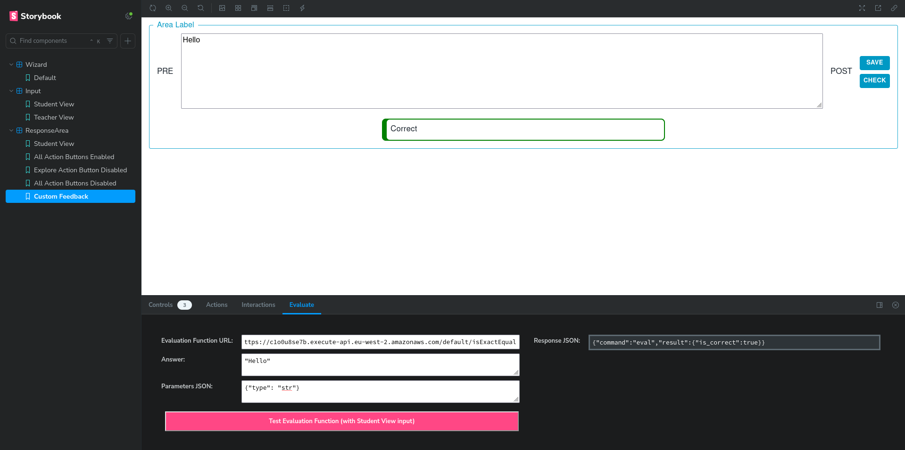
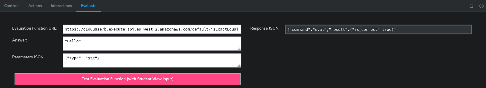

# Using Evaluation functions in the Sandbox

The sandbox addon adds an additional tab in the panel below called **Evaluate** which gives access to a submission form which can be configured to run submissions through the developed response area through many evaluation functions. 

### Running Remote Evaluation Functions

1. To start, use the wizard component to input the expected answer and the response area configurations into the component using the storybook UI. This will be different based on the wizard component that is being developed but in all cases if this was successful you should be able to see the answer field in the **Evaluate** tab be populated with the relevant JSON **Answer** generated from the user input. (The config is internally stored and will apply to all other components in the Storybook)

2. Switch to the Input story (Using the panel of stories found on the left to either the **student** or **teacher** view) and input an answer into the developed input field. This is the answer from the student which you will be testing against. 

3. Now in the **Evaluate** tab enter the URL of the evaluation function that you wish to test against into the **URL field**. This is the URL from the AWS S3 bucket which stores all the evaluation functions that are in current use in Lambda Feedback. 

4. Enter any configuration options that may need to be set to the **Parameters JSON** field. This is dependent on the evaluation function that is being used. More information on this can be found in the [Lambda Feedback Github organisation repos](https://github.com/lambda-feedback). 

5. Then click the **Evaluation Button** at the bottom to send the request to the linked evaluation function. The result should then appear in the results box on the right of the **Evaluate** tab in the **Response JSON** field available for inspection. Any failures in this are likely to mean that the URL inputted is incorrect. You can look at the ef-test-server logs for more information.  

### Running a Locally developed Evaluation Function

The steps for the setup of the wizard component and the input component to set up the answer and the student input is identical as to above. The only difference is that you need to follow the instructions to [Run and Test Functions locally](../evaluation_functions/local.md) (Ensuring that the relevant port that is listening for requests is open from the docker container). Then you can just enter the localhost URL to the relevant port and follow the remainder of the steps above. 

